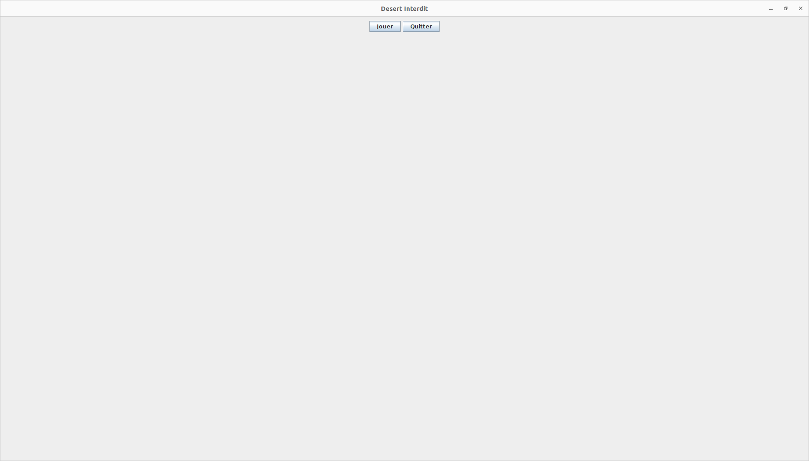
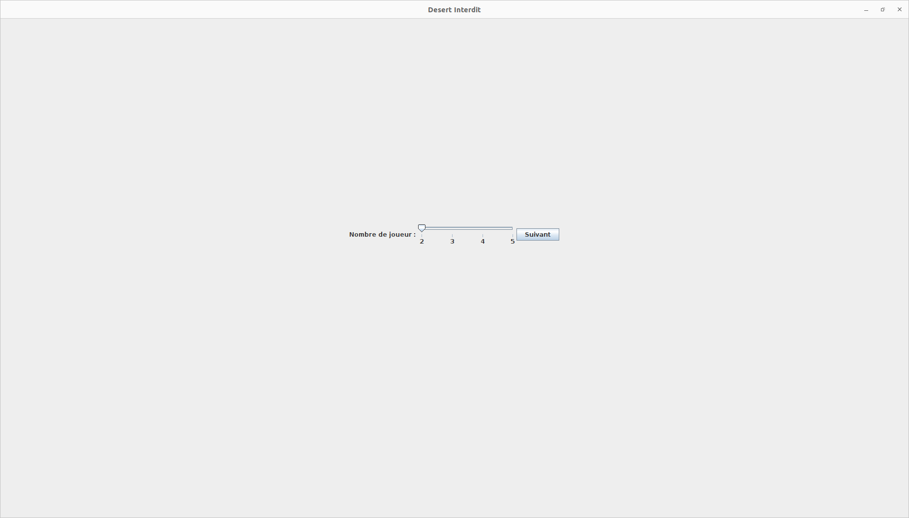
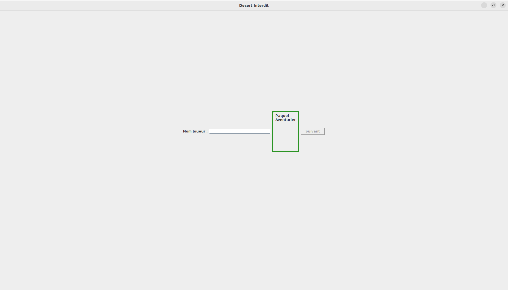
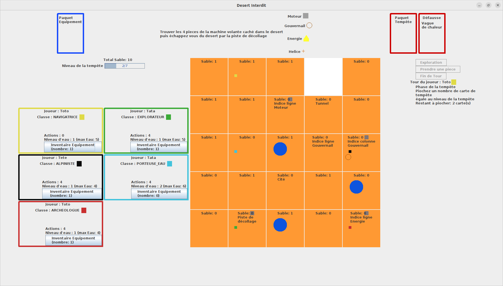

# L'île interdite

## Description
L'île interdite est le projet de Programmation Objet et Génie Logiciel (POGL) pour les L2 Info, Info-Math, MNSI de l'université Paris-Saclay.

## Lancement
```console
java -jar DesertInterdit.jar
```

## Visuals
* Au lancement du jeu, cliquer sur le bouton Jouer.

* Sélectionner le nombre de joueurs à l'aide du curseur puis cliquer sur le bouton Suivant.

* Voici l'écran de création du joueur. 
  * Entrer un nom (max: 15 caractères)
  * Cliquer sur le paquet de cartes 'Aventurier'. Une fenêtre va s'ouvrir vous permettant de prendre connaissance de votre classe pour la partie. Lisez attentivement puis refermer la fenêtre.
  * Cliquer sur suivant pour passer à la création du joueur suivant.
  * Une fois tous les joueurs crée, le dernier bouton suivant lancera la partie.

* Voici l'écran de jeu.
  * La grille centrale de la vue jeu représente le désert interdit. 
    * La case blanche représente l'œil de la tempête. L'œil se déplace en fonction des cartes tempêtes piochées.
    * Les carrés de différentes couleurs représente les joueurs. 
    * Les cercles bleus représentent les cases 'Oasis'. En l'explorant, les joueurs présents sur la case pourront récupérer 2 portions d'eau. L'une des cases est un mirage, les joueurs ne récupéreront pas d'eau.
  
    * Les cases ont différentes couleurs en fonction des possibilités d'action du joueur actuel:
      * Vert: Le joueur peut uniquement se déplacer sur la case.
      * Cyan: Le joueur peut uniquement désensabler la case.
      * Rose: Le joueur peut à la fois se déplacer et désensabler la case.
      
      Si une carte équipement est jouer, les cases peuvent avoir également d'autres couleurs:
      * Turquoise: la case peut être vue grâce au Terrascope.
      * Bordeau: Le joueur peut s'y déplacer en jetpack.
      * Cyan: Le joueur peut désensabler grâce au blaster.
      
      Lorsqu'une case est explorée, elle affiche le nom du type de case. (exemple: Indice colonne hélice, Cité, Mirage, ...)
      * Les petits carré gris sur la partie supérieure d'une case indique la présence d'un engrenage, le joueur dont c'est le tour doit piocher une carte équipement.
      * Les pièces de la machine volante apparaisse également sur les cases, elles auront le même symbole que sur la partie supérieure de la vue jeu.
  * La partie droite de la vue jeu contient les boutons 'Exploration', 'Prendre une pièce' et 'Fin du tour'.
    * Elle affiche le nom du joueur qui est en train de jouer ainsi que son carré de couleur.
    * La vue se met à jour en fonction de l'avancement du joueur durant son tour.
  * Au-dessus de la grille centrale se trouve le paquet Équipement en bleu, l'objectif de la fin de partie et le paquet Tempête ainsi que la défausse du paquet Tempête
    * Cliquer sur la défausse du paquet Tempête permet de voir les cartes tempête déjà joué.
    * La défausse affiche par défaut la dernière carte tempête joué.
    * Lorsque la partie droite indique que le joueur doit piocher une carte équipement, cliquer sur le paquet Équipement en bleu
  * La partie gauche est la vue des joueurs. Chaque joueur dispose de son propre panneau entouré d'une bordure de la même couleur que sa classe.
    * Les points d'action de chaque joueur sont affiché, on peut consulter le nombre de points d'action restante sur le panneau du joueur du tour actuelle.
    * La quantité d'eau disponible pour chaque joueur est affiché
    * Un bouton 'Inventaire Équipement' permet d'afficher une fenêtre qui contient toutes les cartes d'équipement récupéré par le joueur.
    * Les cartes d'équipement peuvent être joué ou échanger depuis cet inventaire.
    * Les pouvoirs des différentes classes sont géré sur la vue de chaque joueur. Des boutons apparaîtront permettant de déclencher le pouvoir des joueurs.
    * Un bouton 'échange d'eau' apparaît si un échange d'eau est possible entre des joueurs.
    


## Installation
Cloner le dépôt et exécuter le .jar

## Support
GitLab issues

## Roadmap
No roadmap

## Contributing
No contribution

## Authors and acknowledgment
Roman Le Montagner 2023

## License
[Apache License, Version 2.0](https://www.apache.org/licenses/LICENSE-2.0)

## Project status
Development finished
